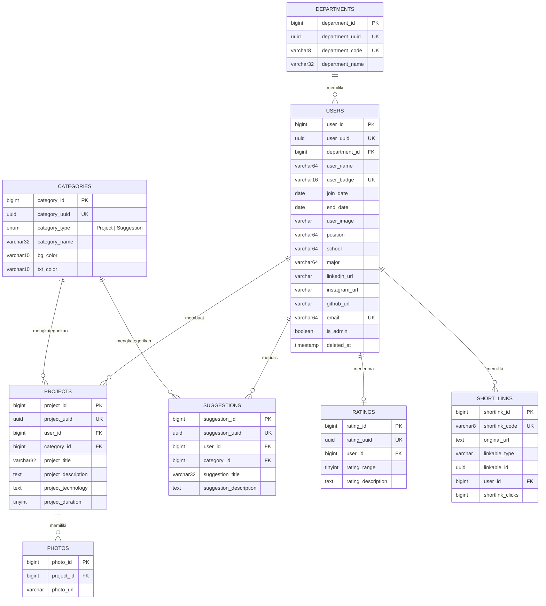

<p align="center">
  
  
  
  
  
</p>

# 📋 InternFolio

> **Platform Portofolio & Manajemen Alumni Anak Magang**

InternFolio adalah platform berbasis web yang dirancang untuk mengelola dan menampilkan portofolio alumni anak magang secara terpusat. Platform ini memudahkan perusahaan dalam mendokumentasikan pengalaman magang, menampilkan proyek-proyek yang telah dikerjakan, serta mengumpulkan saran dan tips berharga dari alumni untuk calon anak magang di masa depan.

### 🎯 Tujuan

- **Dokumentasi** — Menyimpan data lengkap alumni magang beserta pengalaman mereka
- **Showcase** — Menampilkan karya dan proyek unggulan dari anak magang
- **Knowledge Sharing** — Menyebarkan saran, tips, dan insight berharga dari alumni
- **Evaluasi** — Memberikan penilaian (rating) terhadap kinerja anak magang

---

## ✨ Fitur Utama

### 🌐 Public Website

| Fitur | Deskripsi |
|-------|-----------|
| **Dashboard Interaktif** | Halaman utama menampilkan ringkasan statistik real-time: total alumni, proyek, dan saran. Dilengkapi dengan hero section, features section, dan call-to-action |
| **Profil Alumni** | Halaman profil lengkap setiap anak magang, mencakup: foto, nama, badge ID, posisi/jabatan, departemen, asal sekolah, jurusan, periode magang, serta link sosial media (LinkedIn, Instagram, GitHub) |
| **Portofolio Proyek** | Galeri proyek dengan multiple foto, deskripsi lengkap, kategori (dengan badge warna kustom), teknologi yang digunakan, dan durasi pengerjaan |
| **Saran & Tips** | Kumpulan saran berharga dari alumni yang dikategorikan berdasarkan topik, dapat dicari dan difilter |
| **Export CV (PDF)** | Fitur ekspor CV profil anak magang langsung dalam format PDF menggunakan DomPDF |
| **Short Links** | Sistem URL shortener internal (`/s/{code}`) dengan tracking jumlah klik, mendukung link ke profil alumni, proyek, maupun saran |
| **Dark Mode** | Dukungan light/dark theme via Filament Light Switch untuk kenyamanan pengguna |
| **Open Graph & SEO** | Meta tags (Open Graph + Twitter Card) untuk preview yang menarik saat link dibagikan di WhatsApp, Facebook, dan Twitter |
| **Search & Filter** | Pencarian global dan filter berdasarkan departemen serta kategori di semua halaman listing |

### 🔧 Admin Panel (Filament)

| Fitur | Deskripsi |
|-------|-----------|
| **Manajemen Intern** | CRUD lengkap: tambah, edit, hapus (soft delete), dan restore data anak magang. Upload foto profil dengan preview |
| **Manajemen Proyek** | Kelola data proyek termasuk multiple photo upload, kategori, dan teknologi |
| **Manajemen Saran** | Kelola saran dan tips dari alumni |
| **Master Departemen** | Kelola daftar departemen dengan kode unik (maks 8 karakter) dan nama |
| **Master Kategori** | Kelola kategori proyek dan saran, lengkap dengan kustomisasi warna badge (background & text color) |
| **Rating System** | Sistem penilaian kinerja anak magang (skala rating + deskripsi) |
| **Dashboard Analytics** | Widget grafik pertumbuhan jumlah intern dari waktu ke waktu menggunakan chart interaktif |
| **Short Link Manager** | Buat dan kelola shortlink untuk setiap konten dengan statistik klik |

### 📱 REST API (v1)

API yang tersedia dapat digunakan untuk integrasi dengan aplikasi mobile atau pihak ketiga.

- **Authentication** — Laravel Sanctum (Personal Access Token)
- **Prefix** — Semua endpoint menggunakan prefix `/api/v1/`
- **Format Response** — JSON

---

## 🛠️ Tech Stack

| Layer              | Teknologi                                | Keterangan                                     |
| ------------------ | ---------------------------------------- | ---------------------------------------------- |
| **Backend**        | Laravel 12, PHP 8.3+                     | Framework utama dengan service layer pattern    |
| **Admin Panel**    | Filament 4                               | Panel admin modern dengan CRUD auto-generated   |
| **Frontend**       | Blade Components, Tailwind CSS 4, Vite 7 | Component-based templating dengan hot reload    |
| **Database**       | MySQL                                    | Relational database dengan UUID-based routing   |
| **Authentication** | Laravel Sanctum                          | Token-based auth untuk API, session untuk web   |
| **PDF Export**     | barryvdh/laravel-dompdf                  | Generate CV dalam format PDF                    |
| **Charts**         | flowframe/laravel-trend                  | Data aggregation untuk widget chart dashboard   |
| **Cache & Queue**  | Laravel Queue + Cache (database driver)  | Background job processing & caching             |
| **Dark Mode**      | awcodes/light-switch                     | Toggle dark/light theme di Filament             |
| **Rating**         | mokhosh/filament-rating                  | Star rating component di admin panel            |

---

## 📂 Struktur Proyek

```
InternFolio/
├── app/
│   ├── Filament/                # Admin panel
│   │   ├── Resources/           # CRUD resources
│   │   │   ├── Interns/         # Manajemen data intern
│   │   │   ├── Categories/      # Manajemen kategori
│   │   │   └── Departments/     # Manajemen departemen
│   │   └── Widgets/             # Dashboard widgets
│   │       ├── InternGrowthChart.php    # Grafik pertumbuhan
│   │       └── InternGrowthStats.php    # Statistik ringkasan
│   ├── Http/Controllers/        # Web controllers
│   │   ├── Api/                 # REST API controllers
│   │   │   ├── InternController.php
│   │   │   ├── ProjectController.php
│   │   │   ├── SuggestionController.php
│   │   │   └── MasterController.php
│   │   ├── DashboardController.php      # Landing page
│   │   ├── InternController.php         # Halaman alumni
│   │   ├── ProjectController.php        # Halaman proyek
│   │   ├── SuggestionController.php     # Halaman saran
│   │   ├── ExportCVController.php       # Export PDF
│   │   └── ShortLinkController.php      # Redirect shortlink
│   ├── Models/                  # Eloquent models (8 model)
│   └── Services/                # Business logic layer
├── resources/views/
│   ├── home.blade.php           # Landing page
│   ├── interns/                 # Halaman list & detail alumni
│   ├── projects/                # Halaman list & detail proyek
│   ├── suggestions/             # Halaman list & detail saran
│   ├── exports/                 # Template CV PDF
│   └── components/              # Reusable Blade components
│       ├── layouts/             # App layout
│       ├── cards/               # Card components (intern, project, suggestion)
│       ├── heros/               # Hero section
│       └── ...                  # Section, CTA, features, stats, dll.
├── routes/
│   ├── web.php                  # Public web routes
│   └── api.php                  # REST API routes
└── database/migrations/         # 11 migration files
```

---

## 🗃️ Database Schema



---

## 🌐 Web Routes

| Route | Controller | Deskripsi |
|-------|------------|-----------|
| `GET /` | `DashboardController@index` | Landing page dengan statistik & preview konten |
| `GET /interns` | `InternController@index` | Daftar semua alumni (search & filter) |
| `GET /interns/{user}` | `InternController@show` | Detail profil alumni (by UUID) |
| `GET /project` | `ProjectController@index` | Daftar semua proyek (search & filter) |
| `GET /project/{project}` | `ProjectController@show` | Detail proyek (by UUID) |
| `GET /suggestion` | `SuggestionController@index` | Daftar semua saran (search & filter) |
| `GET /suggestion/{suggestion}` | `SuggestionController@show` | Detail saran (by UUID) |
| `GET /export-cv` | `ExportCVController@export` | Export CV ke PDF (auth required) |
| `GET /s/{code}` | `ShortLinkController@redirect` | Redirect shortlink ke URL asli |
| `GET /admin` | Filament Panel | Admin panel (auth required) |

---

## 📡 API Endpoints

Semua endpoint menggunakan prefix `/api/v1/`.

### Master Data

| Method | Endpoint                         | Deskripsi               |
| ------ | -------------------------------- | ----------------------- |
| `GET`  | `/master/list_master_department` | Daftar semua departemen |
| `GET`  | `/master/list_master_category`   | Daftar semua kategori   |

### Intern

| Method | Endpoint              | Deskripsi                               |
| ------ | --------------------- | --------------------------------------- |
| `GET`  | `/intern/dashboard`   | Statistik ringkasan (total, terbaru)    |
| `GET`  | `/intern/index`       | Daftar alumni (support search & filter) |
| `GET`  | `/intern/show/{user}` | Detail profil alumni lengkap            |

### Project

| Method | Endpoint                  | Deskripsi                                |
| ------ | ------------------------- | ---------------------------------------- |
| `GET`  | `/project/dashboard`      | Statistik ringkasan proyek               |
| `GET`  | `/project/index`          | Daftar proyek (support search & filter)  |
| `GET`  | `/project/show/{project}` | Detail proyek dengan foto & teknologi    |

### Suggestion

| Method | Endpoint                          | Deskripsi                              |
| ------ | --------------------------------- | -------------------------------------- |
| `GET`  | `/suggestion/dashboard`           | Statistik ringkasan saran              |
| `GET`  | `/suggestion/index`               | Daftar saran (support search & filter) |
| `GET`  | `/suggestion/show/{suggestion}`   | Detail saran lengkap                   |

---

## 🚀 Instalasi & Setup

### Prasyarat

- PHP >= 8.3 dengan ekstensi: `BCMath`, `Ctype`, `cURL`, `DOM`, `Fileinfo`, `JSON`, `Mbstring`, `OpenSSL`, `PCRE`, `PDO`, `Tokenizer`, `XML`
- Composer 2.x
- Node.js >= 18 & NPM
- MySQL >= 8.0

### Langkah Instalasi

```bash
# 1. Clone repository
git clone https://github.com/username/InternFolio.git
cd InternFolio

# 2. Install PHP dependencies
composer install

# 3. Install JavaScript dependencies
npm install

# 4. Setup environment
cp .env.example .env
php artisan key:generate
```

### Konfigurasi Database

Edit file `.env` dan sesuaikan konfigurasi database:

```env
DB_CONNECTION=mysql
DB_HOST=127.0.0.1
DB_PORT=3306
DB_DATABASE=internfolio
DB_USERNAME=root
DB_PASSWORD=your_password
```

### Konfigurasi Admin

Tambahkan data admin default di file `.env`:

```env
NAME="Nama Admin"
BADGE="ADM001"
EMAIL="admin@internfolio.com"
PASSWORD="password-aman-anda"
```

### Menjalankan Migrasi

```bash
# Buat database 'internfolio' di MySQL terlebih dahulu, lalu:
php artisan migrate --seed

# Buat symbolic link untuk akses file upload
php artisan storage:link
```

### Menjalankan Aplikasi

```bash
# Cara cepat: jalankan server, queue, dan vite sekaligus
composer dev
```

> **💡 Tip:** Perintah `composer dev` akan menjalankan 3 proses secara bersamaan:
> | Proses | Port | Keterangan |
> |--------|------|------------|
> | `php artisan serve` | `:8000` | Laravel development server |
> | `php artisan queue:listen` | — | Queue worker untuk background jobs |
> | `npm run dev` | `:5173` | Vite HMR dev server |

Atau jalankan secara manual di terminal terpisah:

```bash
# Terminal 1: Laravel server
php artisan serve

# Terminal 2: Queue worker
php artisan queue:listen --tries=1

# Terminal 3: Vite dev server
npm run dev
```

Akses aplikasi di **http://localhost:8000** dan admin panel di **http://localhost:8000/admin**.

---

## ⚙️ Environment Variables

| Variable | Default | Deskripsi |
|----------|---------|-----------|
| `APP_NAME` | `Laravel` | Nama aplikasi |
| `APP_URL` | `http://localhost` | URL dasar aplikasi |
| `DB_DATABASE` | `internfolio` | Nama database MySQL |
| `DB_USERNAME` | `root` | Username database |
| `DB_PASSWORD` | — | Password database |
| `QUEUE_CONNECTION` | `database` | Driver queue (database) |
| `CACHE_STORE` | `database` | Driver cache |
| `SESSION_DRIVER` | `database` | Driver session |
| `NAME` | — | Nama admin default (seeder) |
| `BADGE` | — | Badge ID admin default |
| `EMAIL` | — | Email admin default |
| `PASSWORD` | — | Password admin default |
| `API_URL` | — | Base URL API untuk integrasi eksternal |

---

## 🧪 Testing

```bash
# Jalankan semua test
composer test

# Atau langsung dengan artisan
php artisan test
```

---

## 📄 Lisensi

Project ini dibuat untuk keperluan **Tugas Akhir (Skripsi)**.
